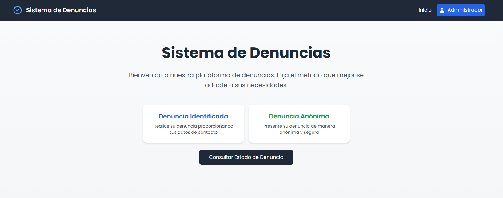
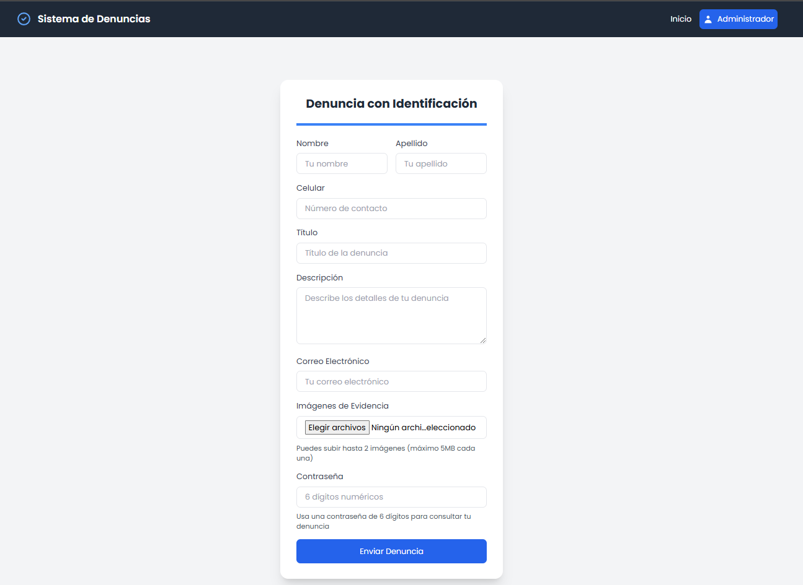
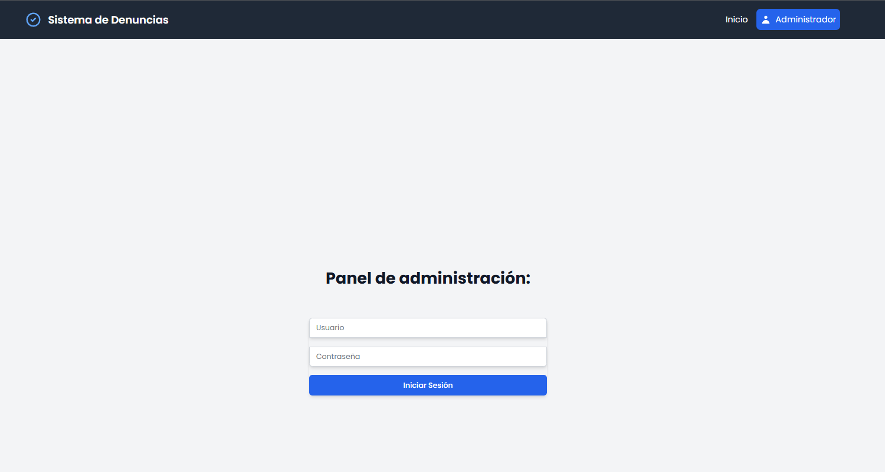

## Sistema de Denuncias

Descripción General del Proyecto
El Sistema de Denuncias Ciudadanas es una plataforma web integral que permite a los ciudadanos reportar incidentes de manera segura, ya sea con identificación personal o de forma anónima. La aplicación proporciona un mecanismo transparente y accesible para documentar y dar seguimiento a diversas problemáticas sociales.

## Capturas de pantalla:

## Características Principales:

### 🔒 Tipos de Denuncias

Denuncia Identificada: Permite a usuarios registrar una denuncia con sus datos personales
Denuncia Anónima: Opción para reportar incidentes sin revelar identidad

### 🖥️ Funcionalidades Clave

Registro de denuncias con información detallada
Carga de hasta 2 imágenes de evidencia
Generación automática de ticket de seguimiento
Consulta de estado de denuncia
Panel de administración para gestión de denuncias

## Tecnologías Utilizadas
Frontend

React.js
Tailwind CSS
React Router
Axios

Backend

Node.js
Express.js
MySQL
Multer (manejo de archivos)
UUID (generación de tickets)

Herramientas de Desarrollo

Vite
ESLint
Git

## Características de Seguridad

Generación de ticket único con UUID
Contraseña de 6 dígitos para cada denuncia
Validaciones de campos en frontend y backend
Manejo seguro de archivos multimedia
Restricciones de acceso en panel administrativo

## Flujo de Trabajo de Denuncia

Selección de tipo de denuncia
Diligenciamiento de formulario
Carga opcional de imágenes
Generación de ticket
Almacenamiento seguro
Posibilidad de consulta posterior

## Requisitos del Sistema
Frontend

Node.js 14+
npm o yarn
Navegador moderno

Backend

Node.js 14+
MySQL 8.0+
Puerto 7070 disponible

